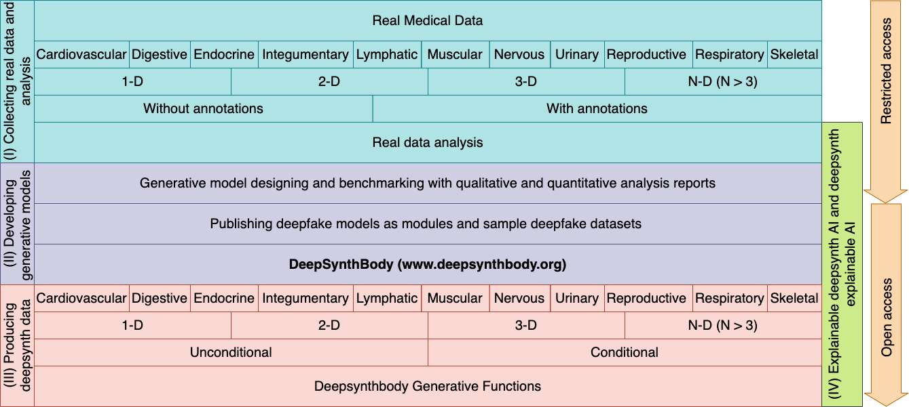

## Welcome to DeepSynthBody Framework




-----------
* **deepsynthbody**
    * **Cardiovascular**
    * **[Digestive](#Digestive)** - A generative model is available to generate deepsynth GI tract images. 
        * GI tract
    * **Endocrine**
    * **Integumentary**
    * **Lymphatic**
    * **Muscular**
    * **Nervous**
    * **Urinary**
    * **Reproductive**
    * **Respiratory**
    * **Skeletal**


------


## Digestive


How to generate deepsynth GI tract images?

```markdown
Syntax highlighted code block

# Header 1
## Header 2
### Header 3

- Bulleted
- List

1. Numbered
2. List

**Bold** and _Italic_ and `Code` text

[Link](url) and 
```

