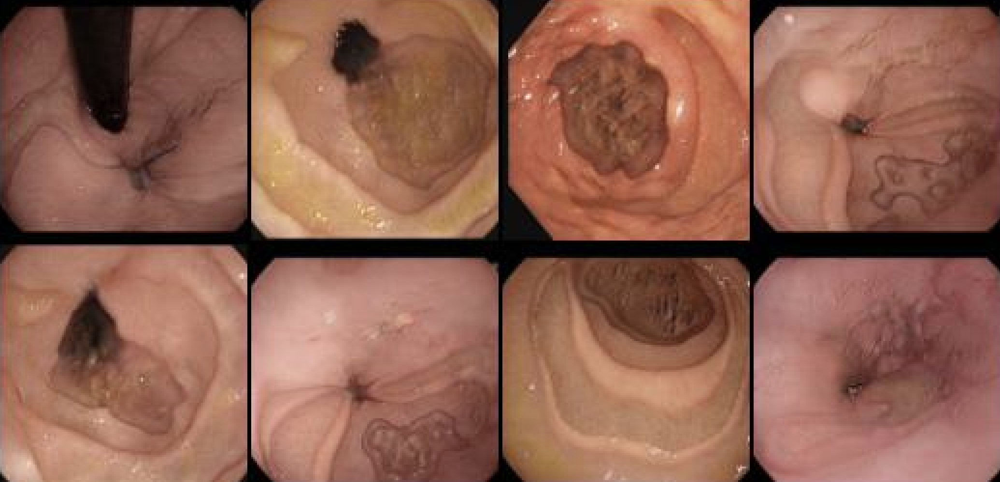
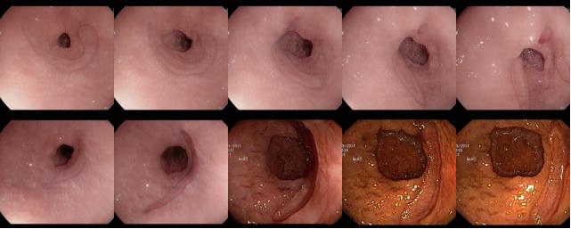
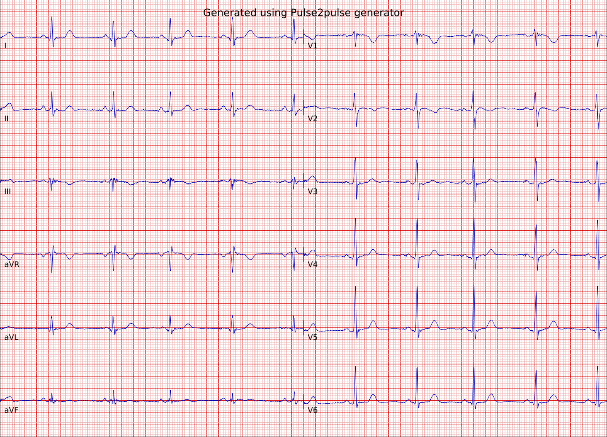
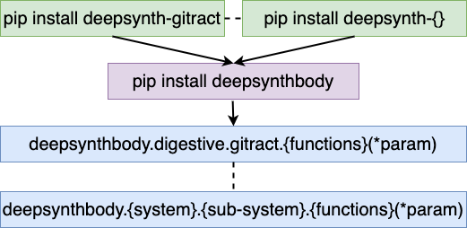

# Welcome to DeepSynthBody
[-->To pip package](https://pypi.org/project/deepsynthbody/)
----

#### **A novel framework to solve data deficiency problems caused by privacy issues and time-consuming and costly medical data annotation processes.**

## Main objectives of Deepsynthbody is to,

1. overcome the privacy related limitations for medical data by producing open access deep synthetic data.
2. reduce the time-consuming and resource-consuming process of medical data labeling and annotation.
3. find inter-correlations of human body organs (how one organ affect to other organs) and functions and reproduce them to produce a new model for the human body. 

## Additionaly, Deepsynthbody works as:

1. a repository for deep generative models used in medicine.
2. a data compression mechanism to keep big medical data sets in a small storage without any privacy concerns and space to save large amounts of the data 


## Big picture of DeepSynthBody framework


----
## How to use this Deepsynthbody as an end-user?


### Generative modles are organized under 11 categories.


* **deepsynthbody**
    * **Cardiovascular**
    * **[Digestive](#Digestive)** - A generative model is available to generate deepsynth GI tract images. 
        * GI tract
    * **Endocrine**
    * **Integumentary**
    * **Lymphatic**
    * **Muscular**
    * **Nervous**
    * **Urinary**
    * **Reproductive**
    * **Respiratory**
    * **Skeletal**

----
## Digestive.GItract


### How to generate random samples?

```python
pip install deepsynthbody 
```

```python
import deepsynthbody.digestive.gitract as gi

>> help(gi.generate)
'''
Help on function generate in module deepsynthbody.digestive.gitract.functions:

generate(name, result_dir, checkpoint_dir, num_img_per_tile, num_of_outputs, trunc_psi=0.75, **kwargs)
    Generate deepfake Gastrointestinal tract images.
    
    Keyword arguments:
    name -- Any name to keep trac of generations
    result_dir -- A directory to save output
    checkpoint_dir -- A directory to download pre-trained checkpoints
    num_img_per_tile -- Number of images per dimenstion of the grid
    num_of_outputs -- Number of outputs to generate
    trunc_psi -- value between 0.5 and 1.0 (default 0.75)
'''

>> gi.generate("test_data", "./result_dir", "./checkpoints", 
            num_img_per_tile = 1, 
            num_of_outputs= 10, trunc_psi=0.75)

```

### Random sample generated from **deepsynthbody.digestive.gitract.generate()**


### How to generate interpolated samples between random samples?

```python
import deepsynthbody.digestive.gitract as gi

>> help(gi.generate_interpolation)
'''
Help on function generate_interpolation in module deepsynthbody.digestive.gitract.functions:

generate_interpolation(name, result_dir, checkpoint_dir, num_img_per_tile, num_of_outputs, num_of_steps_to_interpolate, save_frames, trunc_psi=0.75, **kwargs)
    Generate deepfake Gastrointestinal tract images.
    
    Keyword arguments:
    name -- Any name to keep trac of generations
    result_dir -- A directory to save output
    checkpoint_dir -- A directory to download pre-trained checkpoints
    num_img_per_tile -- Number of images per dimenstion of the grid
    num_of_outputs -- Number of outputs to generate
    num_of_steps_to_interpolate -- Number of step between two random points
    save_frames -- True if you want frame by frame, otherwise .gif will be generated
    trunc_psi -- value between 0.5 and 1.0 (default 0.75)
'''

>> gi.generate_interpolation("test_data", "./result_dir", "./checkpoints",
                        num_img_per_tile=1,
                        num_of_outputs=1,
                        save_frames=True,
                        num_of_steps_to_interpolate=100,seed=100)
```
### Random sample generated from **deepsynthbody.digestive.gitract.generate_interpolation()**


#### Reference for this implementation:
```markdown
@article{Karras2019stylegan2,
  title   = {Analyzing and Improving the Image Quality of {StyleGAN}},
  author  = {Tero Karras and Samuli Laine and Miika Aittala and Janne Hellsten and Jaakko Lehtinen and Timo Aila},
  journal = {CoRR},
  volume  = {abs/1912.04958},
  year    = {2019},
}

@article{zhao2020diffaugment,
    title   = {Differentiable Augmentation for Data-Efficient GAN Training},
    author  = {Zhao, Shengyu and Liu, Zhijian and Lin, Ji and Zhu, Jun-Yan and Han, Song},
    journal = {arXiv preprint arXiv:2006.10738},
    year    = {2020}
}

@misc{karras2020training,
    title   = {Training Generative Adversarial Networks with Limited Data},
    author  = {Tero Karras and Miika Aittala and Janne Hellsten and Samuli Laine and Jaakko Lehtinen and Timo Aila},
    year    = {2020},
    eprint  = {2006.06676},
    archivePrefix = {arXiv},
    primaryClass = {cs.CV}
}
```
----
## Generating DeepFake ECGs with 8-leads.
```python
import deepsynthbody.cardiovascular.ecg as ecg

help(ecg.generate)

Help on function generate in module deepsynthbody.cardiovascular.ecg.functions:

generate(num_ecg, out_dir, start_id=0, device='cpu', **kwargs)
    Generate DeepFake 12-leads 10-sec long ECG.
    
    Parameters
    ----------------
    num_ecg: int
        Number of DeepFake ECGs to generate randomly.
    out_dir: str
        A directory to save output files with extension ".asc". 
    start_id: int 
        A interger number to start file names. Default value is 0.and
    device: str
        A device to run the generator. Use strin "cpu" to run on CPU and "cuda" to run on a GPU. 
    
    Return
    ------
    None
        No return value.

# Run on CPU (default setting)
ecg.generate(5, ".", start_id=0, device="cpu") # Generate 5 ECGs to the current folder starting from id=0

# Run on GPU 
ecg.generate(5, ".", start_id=0, device="cuda") # Generate 5 ECGs to the current folder starting from id=0
```

The generator functions can generate DeepFake ECGs with 8-lead values [lead names from first coloum to eighth colum: 'I','II','V1','V2','V3','V4','V5','V6'] for 10s (5000 values per lead). These 8-leads format can be converted to 12-leads format using the following equations.
```Python
lead III value = (lead II value) - (lead I value)
lead aVR value = -0.5*(lead I value + lead II value)
lead aVL value = lead I value - 0.5 * lead II value
lead aVF value = lead II value - 0.5 * lead I value
```


### Generated DeepFake ECG


----
----
## How to contribute to Deepsynthbody as a researcher?




----


------

## Citation:
```latex
@inproceedings{deepsynthbody,
  title={DeepSynthBody: the beginning of the end for datadeficiency in medicine},
  author={Thambawita, Vajira and Hicks, Steven A. and Isaksen, Jonas and Stensen, Mette Haug and Haugen, Trine B. and Kanters, Jørgen, and Parasa, Sravanthi and Lange, Thomas de and Johansen, Håvard D. and Johanse, Dag and Hammer, Hugo L. and Halvorsen, P{\aa}l and Riegler, Michael A.},
  booktitle={In Proceedings of the International Conference on Applied Artificial Intelligence (ICAPAI 2021)},
  year={2021}
}
```


## contact us: 
[deepsynthbody@gmail.com](deepsynthbody@gmail.com)

----

